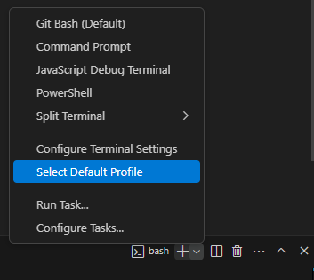
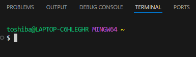
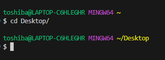
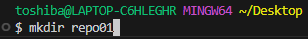

# **Como crear un repositorio:**  
  
1.  **Instalación de Git y VisualCode**

	Debemos descargar estas herramientas desde sus respectivas paginas oficiales:  

     

  

  

2.  **Configuración de Git en Visual Code**

	Una vez descargado e instalado, procederemos a configurar Git, para ello abrimos Visual Studio Code y procedemos a configurar el terminal  

      
      
    Acto seguido seleccionaremos GitBash como terminal por defecto y ya podremos trabajar con la consola de Git, esta deberia de verse así:  
    
      
      
3.  **Creación de repositorio**  
    Una vez estamos en la terminal de Git, podemos crear nuestra directorio el cual utilizaremos como repositorio para nuestro proyecto.    
       
    Para ello usaremos el comando cd para movernos entre directorios hasta elegir donde queremos crear nuestro repositorio, en este caso usaremos el escritorio  

      

    Una ves estamos en la ruta en la cual queremos crear nuestro repositorio, procederemos a crear la carpeta que se convertira en nuestro futuro repositorio, para ello usaremos el comando mkdir    

      

    Listo! Una vez creada la carpeta la convertiremos en un repositorio, para ello usaremos el comando git init